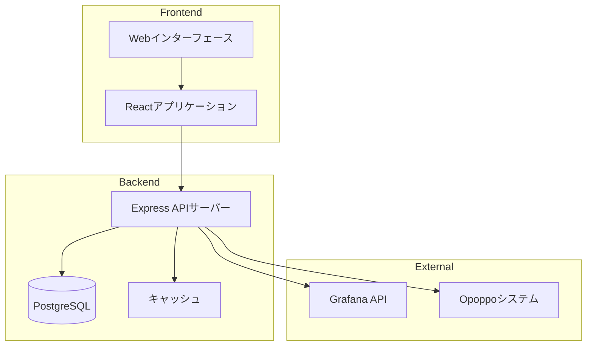
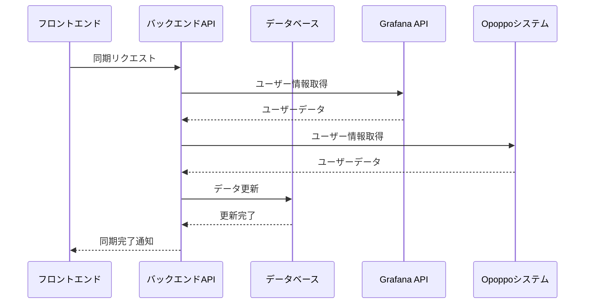
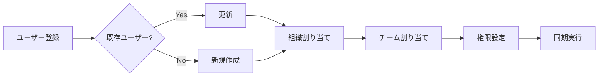
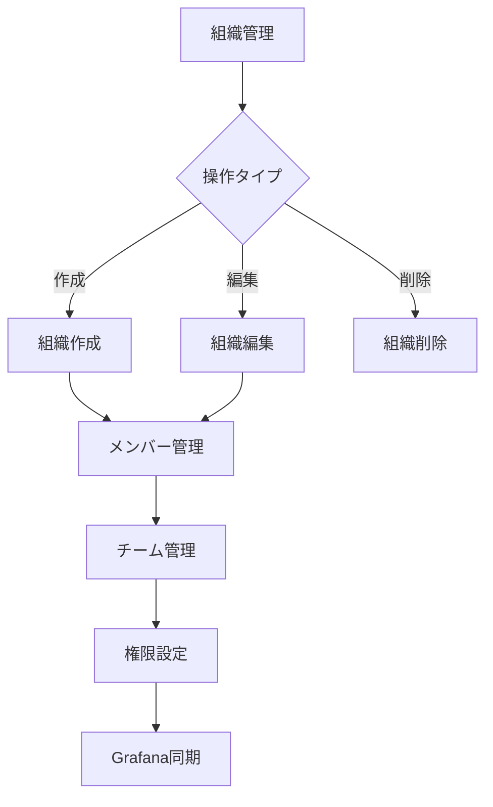
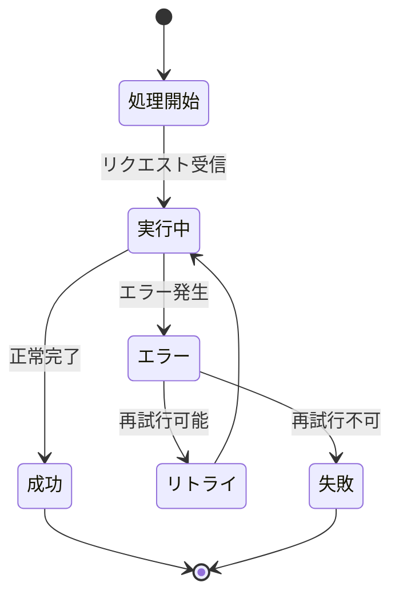

# Grafana Master Management System プロセスフロー図

## 1. システム全体の構成

```mermaid
graph TB
    subgraph Frontend
        UI[Webインターフェース]
        React[Reactアプリケーション]
    end
    
    subgraph Backend
        API[Express APIサーバー]
        DB[(PostgreSQL)]
        Cache[キャッシュ]
    end
    
    subgraph External
        Grafana[Grafana API]
        Opoppo[Opoppoシステム]
    end
    
    UI --> React
    React --> API
    API --> DB
    API --> Cache
    API --> Grafana
    API --> Opoppo
```

## 2. データ同期フロー

```mermaid
sequenceDiagram
    participant UI as フロントエンド
    participant API as バックエンドAPI
    participant DB as データベース
    participant Grafana as Grafana API
    participant Opoppo as Opoppoシステム
    
    UI->>API: 同期リクエスト
    API->>Grafana: ユーザー情報取得
    Grafana-->>API: ユーザーデータ
    API->>Opoppo: ユーザー情報取得
    Opoppo-->>API: ユーザーデータ
    API->>DB: データ更新
    DB-->>API: 更新完了
    API-->>UI: 同期完了通知
```

## 3. ユーザー管理フロー

```mermaid
graph LR
    A[ユーザー登録] --> B{既存ユーザー?}
    B -->|Yes| C[更新]
    B -->|No| D[新規作成]
    C --> E[組織割り当て]
    D --> E
    E --> F[チーム割り当て]
    F --> G[権限設定]
    G --> H[同期実行]
```

## 4. 組織・チーム管理フロー

```mermaid
flowchart TD
    A[組織管理] --> B{操作タイプ}
    B -->|作成| C[組織作成]
    B -->|編集| D[組織編集]
    B -->|削除| E[組織削除]
    
    C --> F[メンバー管理]
    D --> F
    F --> G[チーム管理]
    G --> H[権限設定]
    H --> I[Grafana同期]
```

## 5. エラーハンドリングフロー

```mermaid
stateDiagram-v2
    [*] --> 処理開始
    処理開始 --> 実行中: リクエスト受信
    実行中 --> 成功: 正常完了
    実行中 --> エラー: エラー発生
    エラー --> リトライ: 再試行可能
    エラー --> 失敗: 再試行不可
    リトライ --> 実行中
    成功 --> [*]
    失敗 --> [*]
```
